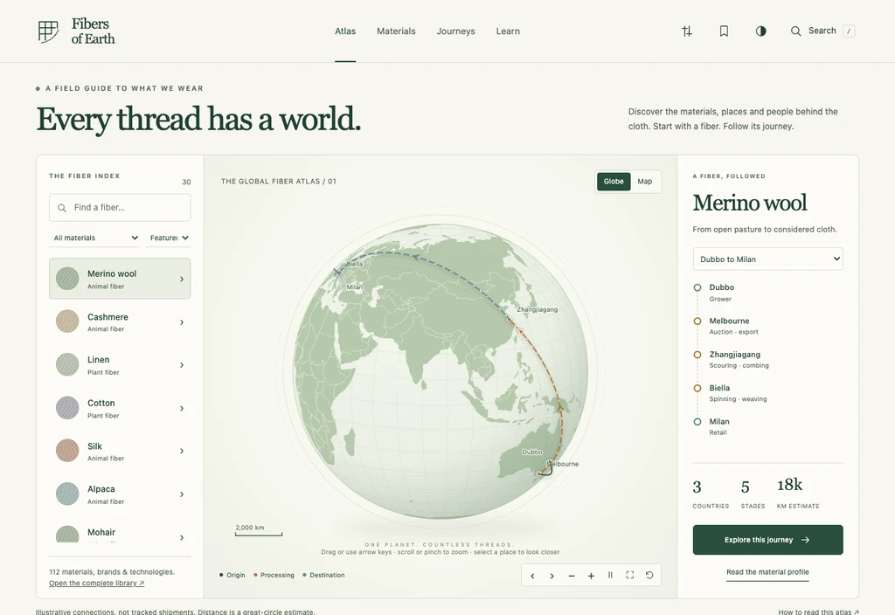

<p align="center"><strong>FIBERS OF EARTH</strong></p>
<h1 align="center">Every thread has a world.</h1>
<p align="center">An independent textile atlas by Chaos.</p>

[](https://github.com/ChaseHendrick/FibersOfEarth/actions/workflows/check.yml)


[](LICENSE)

Explore what clothes are made of, the names behind their labels, and the places and processes that connect them. Fibers of Earth brings together **112 material and technology profiles**, a **2,241-entry brand directory**, **115 illustrative journeys**, **102 glossary terms**, and **10 field notes**.

[Open the atlas](https://chasehendrick.github.io/FibersOfEarth/) · [Build it locally](#run-locally) · [Research coverage](docs/BRAND_RESEARCH.md)



*Recorded from the repository build. [60 fps video](docs/screenshots/site-tour.mp4) · [GIF version](docs/screenshots/site-tour.gif) · [Motion-free overview](docs/screenshots/readme-poster.png). The hosted site is updated separately through the Deploy site workflow.*

## Explore the site

| Area | What you can do |
| --- | --- |
| Atlas | Follow 30 mapped materials on a globe or flat map. Explore route stops, zoom, rotate, and open related profiles. |
| Material library | Search 112 profiles by name, aliases or technical terms. Read composition, processing, history, care, buying cues, research references and FAQs. |
| Brands, mills & makers | Search 2,241 entries and filter by category, country association, research depth or reported end date. Follow company sources and see open research questions. |
| Saved brands | Keep a shortlist on your device, compare the first four saved entries, and export it as JSON. Filtered directory views can be shared by URL. |
| Material comparison | Compare three materials across composition, history, care, uses and sourcing questions. Save materials separately from brands. |
| Journeys | Browse 115 educational routes by material or place. Sort by modeled distance or stage count, and export route data. |
| Field notes & glossary | Read 10 practical guides and 102 detailed terms, including Fresco, gabardine and high-twist yarn. Follow related materials and source references. |
| Science lab | Switch weave structures, estimate ideal filament diameter, and convert yarn counts and fabric weights. |
| Reading & display | Open pages without JavaScript, print profiles, copy citations, reduce motion, enlarge text, increase contrast or underline links. |

Press `/` to search across materials, brands, glossary terms, journeys and field notes. The core application, directory and base map work offline without an account or API key.

## Research you can inspect

The directory separates **32 linked textile profiles**, **227 additional producer-reference entries**, and **1,982 catalog records**. Its research snapshot includes 10,597 source-linked catalog statements and 64 original company-research notes across 62 brands. The 32 linked profiles are also part of the material library; these counts are not separate brand totals.

Catalog statements are attributed to Wikidata and have not all been independently checked. Company sources describe their own products and history. Historical businesses are included, an absent closure date does not establish current trading, and headquarters do not establish manufacturing or fiber origin. Each entry makes its research depth and gaps visible.

The atlas routes are illustrative models, not verified supplier relationships or live shipments. Distances sum great-circle segments and do not estimate transport emissions. Inclusion is not a certification or endorsement.

Read the [brand research method](docs/BRAND_RESEARCH.md), [content and evidence guide](docs/CONTENT.md), and [third-party notices](THIRD_PARTY_NOTICES.md).

## Run locally

Requires Node.js 22 or newer.

```sh
git clone https://github.com/ChaseHendrick/FibersOfEarth.git
cd FibersOfEarth
npm ci
npm run build
npm run dev
```

Open [http://127.0.0.1:4173](http://127.0.0.1:4173). Rebuild after editing source files. The preview server reads the generated files from `dist/`.

To read without a server, open **`dist/offline.html`**. It bundles the interactive application, brand directory, search and base map. Detailed coastlines load only when hosted; following external sources requires a network connection.

The build also creates JavaScript-free reading editions in `dist/materials/`, `dist/brands/`, `dist/glossary/` and `dist/learn/`, plus a 2,470-URL sitemap and the brand-directory JSON download. Deploy the whole `dist/` folder. Build output is not committed.

## Check and maintain

```sh
# Install the browser once, then run the full check sequence.
npx playwright install chromium
npm run babysit
```

`babysit` runs unit tests, directory provenance validation, the production build and browser checks. It stops at the first failure. The same sequence runs on pushes and pull requests; the Checks workflow also supports manual dispatch. **There is no schedule or automatic deployment.**

For a smaller check, use `npm test`, `npm run check:directory`, `npm run build` or `npm run test:browser`. The browser command starts its own preview server. Set `BROWSER_CHANNEL=chrome` to use installed Chrome, or `BROWSER_EXECUTABLE` for a particular Chromium executable.

See [testing and recorded evidence](docs/TESTING.md) and [deployment instructions](docs/DEPLOYMENT.md). To regenerate the animated tour, video and still images, see the [media capture guide](docs/MEDIA.md).

## Privacy

Saved material IDs, saved brand IDs and display preferences stay in your browser. Exports are generated locally. There is no account, analytics, advertising or application backend. The host receives normal page requests; external references open under their own sites’ policies. [Privacy details and storage keys](PRIVACY.md).

## Documentation

| Guide | What it covers |
| --- | --- |
| [Contributing](CONTRIBUTING.md) | Content corrections, development and review expectations. |
| [Architecture](docs/ARCHITECTURE.md) | Source datasets, search, rendering, storage and build outputs. |
| [Brand research](docs/BRAND_RESEARCH.md) | Discovery, provenance, evidence levels and known gaps. |
| [Content methodology](docs/CONTENT.md) | Material profiles, source standards and illustrative routes. |
| [Glossary research](docs/GLOSSARY-RESEARCH.md) | Term definitions, research scope and reading editions. |
| [Testing](docs/TESTING.md) | Unit, data, browser, accessibility and offline checks. |
| [Deployment](docs/DEPLOYMENT.md) | GitHub Pages, canonical URLs, static hosting and offline use. |
| [Media](docs/MEDIA.md) | Reproduce the README tour and screenshots. |

The [micron-scale illustration](docs/graphics/micron-scale.svg) and [Italian textile districts sketch](docs/graphics/italy-districts.svg) accompany the learning material. See the [changelog](CHANGELOG.md) for releases and the [security policy](SECURITY.md) for reporting concerns.

## Credits and license

Created by **Chaos**. Original application code and editorial text are [MIT licensed](LICENSE). Wikidata structured records are CC0. Brand names and trademarks belong to their respective owners; inclusion does not imply affiliation. Map and library licenses are documented in [THIRD_PARTY_NOTICES.md](THIRD_PARTY_NOTICES.md).
